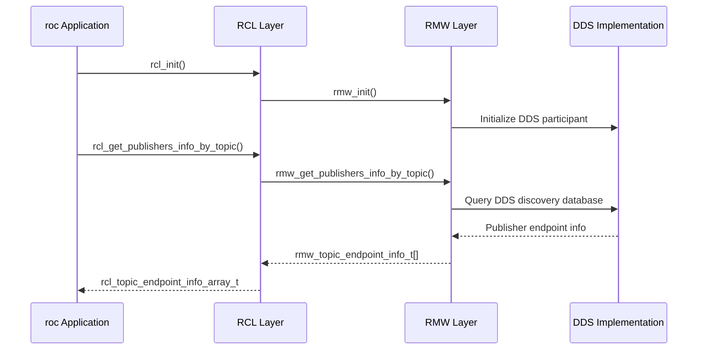

# ROS 2 Architecture Overview

ROS 2 (Robot Operating System 2) is a sophisticated middleware framework designed for distributed robotics applications. Understanding its layered architecture is crucial for implementing effective bindings and tools like `roc`.

## Layered Architecture

ROS 2 follows a layered architecture that separates concerns and provides modularity:

```
┌─────────────────────────────────────────┐
│           User Applications             │
├─────────────────────────────────────────┤
│              ROS 2 API                  │
│         (rclcpp, rclpy, etc.)           │
├─────────────────────────────────────────┤
│               RCL Layer                 │
│        (Robot Control Library)         │
├─────────────────────────────────────────┤
│               RMW Layer                 │
│       (ROS Middleware Interface)        │
├─────────────────────────────────────────┤
│          DDS Implementation             │
│    (Fast-DDS, Cyclone DX, etc.)        │
└─────────────────────────────────────────┘
```

## Key Components

### 1. DDS Layer (Bottom)
- **Purpose**: Provides the actual networking and discovery mechanisms
- **Examples**: Fast-DDS, Cyclone DX, Connext DDS
- **Responsibilities**:
  - Network communication
  - Service discovery
  - Quality of Service (QoS) enforcement
  - Data serialization/deserialization

### 2. RMW Layer (ROS Middleware Interface)
- **Purpose**: Abstract interface that isolates ROS 2 from specific DDS implementations
- **Location**: `/opt/ros/jazzy/include/rmw/`
- **Key Types**:
  - `rmw_context_t` - Middleware context
  - `rmw_node_t` - Node representation
  - `rmw_publisher_t` / `rmw_subscription_t` - Topic endpoints
  - `rmw_qos_profile_t` - Quality of Service profiles
  - `rmw_topic_endpoint_info_t` - Detailed endpoint information

### 3. RCL Layer (Robot Control Library)
- **Purpose**: Provides a C API that manages the ROS 2 graph and lifecycle
- **Location**: `/opt/ros/jazzy/include/rcl/`
- **Key Functions**:
  - `rcl_init()` - Initialize RCL context
  - `rcl_node_init()` - Create nodes
  - `rcl_get_topic_names_and_types()` - Graph introspection
  - `rcl_get_publishers_info_by_topic()` - Detailed topic information

### 4. Language-Specific APIs
- **rclcpp**: C++ client library
- **rclpy**: Python client library
- **rclrs**: Rust client library (emerging)

## Why This Architecture Matters for `roc`

The `roc` tool operates primarily at the **RCL and RMW layers**, bypassing the higher-level language APIs to:

1. **Direct Access**: Get raw, unfiltered information about the ROS 2 graph
2. **Performance**: Avoid overhead of higher-level abstractions
3. **Completeness**: Access all available metadata (QoS, GIDs, type hashes)
4. **Compatibility**: Work consistently across different ROS 2 distributions

## Discovery and Communication Flow



This architecture allows `roc` to access detailed information that is often abstracted away in higher-level tools, making it particularly powerful for debugging and system introspection.
