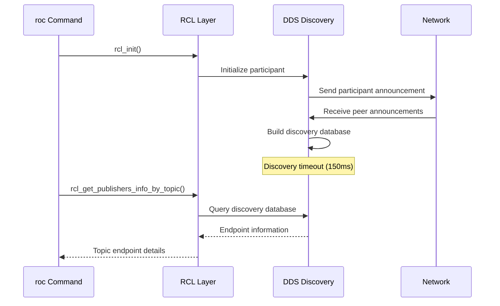

# Endpoint Discovery

Endpoint discovery is the process by which `roc` finds and identifies publishers and subscribers in the ROS 2 system. This chapter explains how the discovery mechanism works, the information it provides, and how it differs from daemon-based approaches.

## Discovery Architecture

### Direct DDS Discovery vs Daemon

`roc` uses **direct DDS discovery**, which differs from the `ros2` CLI daemon approach:

| Approach | Mechanism | Pros | Cons |
|----------|-----------|------|------|
| **Direct DDS** (roc) | Directly queries DDS discovery database | Always current, no daemon dependency | Slower startup, repeated discovery overhead |
| **Daemon** (ros2 cli) | Queries centralized daemon cache | Fast queries, shared discovery | Stale data possible, daemon dependency |

### Discovery Flow



## Discovery Timing

### Initialization Sequence
```rust
pub fn new_with_discovery(discovery_time: std::time::Duration) -> Result<Self> {
    // 1. Initialize RCL context and node
    let graph_context = RclGraphContext { context, node, is_initialized: true };
    
    // 2. Wait for DDS discovery to converge
    graph_context.wait_for_graph_discovery(discovery_time)?;
    
    Ok(graph_context)
}

fn wait_for_graph_discovery(&self, discovery_time: std::time::Duration) -> Result<()> {
    // DDS discovery is asynchronous - wait for network convergence
    std::thread::sleep(discovery_time);
    Ok(())
}
```

### Discovery Timeout Selection

The default 150ms timeout balances several factors:

**Too Short (< 50ms)**
- May miss endpoints that haven't completed discovery
- Inconsistent results across runs
- Network-dependent behavior

**Optimal (100-200ms)**  
- Allows most DDS implementations to converge
- Reasonable for interactive use
- Reliable across different networks

**Too Long (> 500ms)**
- Slow interactive response
- Diminishing returns for completeness
- User experience degradation

## Endpoint Information Structure

### Complete Endpoint Data
```rust
pub struct TopicEndpointInfo {
    pub node_name: String,              // ROS node name
    pub node_namespace: String,         // ROS namespace
    pub topic_type: String,             // Message type
    pub topic_type_hash: String,        // Message definition hash  
    pub endpoint_type: EndpointType,    // PUBLISHER/SUBSCRIPTION
    pub gid: Vec<u8>,                   // DDS Global ID
    pub qos_profile: QosProfile,        // Complete QoS settings
}
```

### Endpoint Type Classification
```rust
#[derive(Debug, Clone)]
pub enum EndpointType {
    Publisher,     // Sends messages
    Subscription,  // Receives messages  
    Invalid,       // Error state
}
```

## Discovery Data Sources

### RCL Discovery Functions

**Basic Topology**
```c
// Get all topics and types
rcl_ret_t rcl_get_topic_names_and_types(
    const rcl_node_t * node,
    rcutils_allocator_t * allocator,
    bool no_demangle,
    rcl_names_and_types_t * topic_names_and_types
);

// Count endpoints
rcl_ret_t rcl_count_publishers(const rcl_node_t * node, const char * topic_name, size_t * count);
rcl_ret_t rcl_count_subscribers(const rcl_node_t * node, const char * topic_name, size_t * count);
```

**Detailed Endpoint Information**
```c
// Get detailed publisher info
rcl_ret_t rcl_get_publishers_info_by_topic(
    const rcl_node_t * node,
    rcutils_allocator_t * allocator,
    const char * topic_name,
    bool no_mangle,
    rcl_topic_endpoint_info_array_t * publishers_info
);

// Get detailed subscriber info  
rcl_ret_t rcl_get_subscriptions_info_by_topic(
    const rcl_node_t * node,
    rcutils_allocator_t * allocator,
    const char * topic_name,
    bool no_mangle,
    rcl_topic_endpoint_info_array_t * subscriptions_info
);
```

### Information Extraction Process

```rust
pub fn get_publishers_info(&self, topic_name: &str) -> Result<Vec<TopicEndpointInfo>> {
    let topic_name_c = CString::new(topic_name)?;
    
    unsafe {
        let mut allocator = rcutils_get_default_allocator();
        let mut publishers_info: rcl_topic_endpoint_info_array_t = std::mem::zeroed();
        
        // Query DDS discovery database
        let ret = rcl_get_publishers_info_by_topic(
            &self.node,
            &mut allocator,
            topic_name_c.as_ptr(),
            false, // no_mangle: follow ROS naming conventions
            &mut publishers_info,
        );
        
        if ret != 0 {
            return Err(anyhow!("Failed to get publishers info: {}", ret));
        }
        
        // Extract information from each endpoint
        let mut result = Vec::new();
        for i in 0..publishers_info.size {
            let info = &*(publishers_info.info_array.add(i));
            
            result.push(TopicEndpointInfo {
                node_name: extract_string(info.node_name),
                node_namespace: extract_string(info.node_namespace),
                topic_type: extract_string(info.topic_type),
                topic_type_hash: format_topic_type_hash(&info.topic_type_hash),
                endpoint_type: EndpointType::from_rmw(info.endpoint_type),
                gid: extract_gid(&info.endpoint_gid),
                qos_profile: QosProfile::from_rmw(&info.qos_profile),
            });
        }
        
        // Clean up allocated memory
        rmw_topic_endpoint_info_array_fini(&mut publishers_info, &mut allocator);
        
        Ok(result)
    }
}
```

## Global Identifiers (GIDs)

### GID Structure and Format

GIDs are 16-byte unique identifiers assigned by the DDS implementation:

```
Byte Layout: [01][0f][ba][ec][43][55][39][96][00][00][00][00][00][00][14][03]
Display:     01.0f.ba.ec.43.55.39.96.00.00.00.00.00.00.14.03
```

**GID Components** (implementation-specific):
- **Bytes 0-3**: Often participant identifier
- **Bytes 4-7**: Usually timestamp or sequence
- **Bytes 8-11**: Typically zero padding
- **Bytes 12-15**: Entity identifier within participant

### GID Extraction and Formatting

```rust
// Extract GID from C array
let gid = std::slice::from_raw_parts(
    info.endpoint_gid.as_ptr(), 
    info.endpoint_gid.len()
).to_vec();

// Format for display
fn format_gid(gid: &[u8]) -> String {
    gid.iter()
       .map(|b| format!("{:02x}", b))
       .collect::<Vec<String>>()
       .join(".")
}
```

### GID Uniqueness Properties

- **Global**: Unique across entire DDS domain
- **Persistent**: Remains same for endpoint lifetime
- **Deterministic**: Recreated consistently by DDS
- **Opaque**: Implementation-specific internal structure

## Topic Type Hashes

### RIHS Format (ROS Interface Hash Standard)

Topic type hashes follow the RIHS format:
```
RIHS01_<hex_hash>
```

**Components**:
- `RIHS`: ROS Interface Hash Standard identifier
- `01`: Version number (currently 1)
- `<hex_hash>`: SHA-256 hash of message definition

### Hash Generation Process

1. **Canonical representation**: Message definition in canonical form
2. **Hash calculation**: SHA-256 of canonical representation  
3. **Encoding**: Hexadecimal encoding of hash bytes
4. **Formatting**: Prepend RIHS version identifier

### Example Hash
```
RIHS01_df668c740482bbd48fb39d76a70dfd4bd59db1288021743503259e948f6b1a18
```

This represents the hash for `std_msgs/msg/String`.

### Hash Extraction
```rust
fn format_topic_type_hash(hash: &rosidl_type_hash_t) -> String {
    let hash_bytes = unsafe {
        std::slice::from_raw_parts(hash.value.as_ptr(), hash.value.len())
    };
    let hex_hash = hash_bytes.iter()
        .map(|b| format!("{:02x}", b))
        .collect::<String>();
    format!("RIHS01_{}", hex_hash)
}
```

## Discovery Scope and Filtering

### Domain Isolation

Discovery is limited by ROS domain:
```rust
// Read ROS_DOMAIN_ID from environment (default: 0)
let domain_id = env::var("ROS_DOMAIN_ID")
    .ok()
    .and_then(|s| s.parse::<usize>().ok())
    .unwrap_or(0);

// Configure RMW with domain ID
(*rmw_init_options).domain_id = domain_id;
```

### Topic Name Filtering

The discovery system can filter by:
- **Exact topic name**: `rcl_get_publishers_info_by_topic("/chatter", ...)`
- **Name mangling**: `no_mangle` parameter controls ROS naming conventions

### Endpoint Filtering

Results can be filtered by:
- **Endpoint type**: Publishers vs subscribers
- **Node name/namespace**: Filter by owning node
- **QoS compatibility**: Only compatible endpoints

## Discovery Performance

### Timing Characteristics

| Operation | Typical Time | Factors |
|-----------|-------------|---------|
| Context initialization | 150ms | DDS discovery timeout |
| Topic list query | 1-5ms | Number of topics |
| Endpoint count | 1-3ms | Number of endpoints |
| Detailed endpoint info | 5-20ms | QoS complexity, endpoint count |

### Memory Usage

| Component | Memory Usage | Notes |
|-----------|-------------|-------|
| RCL context | ~1MB | DDS participant overhead |
| Topic list | ~1KB per topic | Name and type strings |
| Endpoint info | ~500B per endpoint | QoS and metadata |
| Peak processing | +50% | During C to Rust conversion |

### Optimization Strategies

**Context Reuse**
```rust
// Current: Create new context per operation
let context = RclGraphContext::new()?;
let info = context.get_publishers_info(topic)?;

// Potential: Reuse context across operations
let context = RclGraphContext::new()?;
let info1 = context.get_publishers_info(topic1)?;
let info2 = context.get_publishers_info(topic2)?;
```

**Batch Operations**
```rust
// Current: Separate calls for publishers and subscribers
let pubs = context.get_publishers_info(topic)?;
let subs = context.get_subscribers_info(topic)?;

// Potential: Combined endpoint query
let endpoints = context.get_all_endpoints_info(topic)?;
```

## Error Handling and Edge Cases

### Discovery Failures

**No Endpoints Found**
- Topic exists but no active endpoints
- Discovery timing issues
- Network connectivity problems

**Partial Discovery**  
- Some endpoints discovered, others missed
- Network partitions or high latency
- DDS implementation differences

**Invalid Data**
- Corrupted endpoint information
- Unsupported QoS policies
- Protocol version mismatches

### Error Recovery Strategies

```rust
// Retry with longer discovery timeout
if endpoints.is_empty() {
    let context = RclGraphContext::new_with_discovery(Duration::from_millis(500))?;
    endpoints = context.get_publishers_info(topic)?;
}

// Validate endpoint data
for endpoint in &endpoints {
    if endpoint.node_name.is_empty() {
        warn!("Endpoint with empty node name: {:?}", endpoint.gid);
    }
}
```

The endpoint discovery system provides comprehensive visibility into the ROS 2 computation graph, enabling effective debugging and system understanding.
