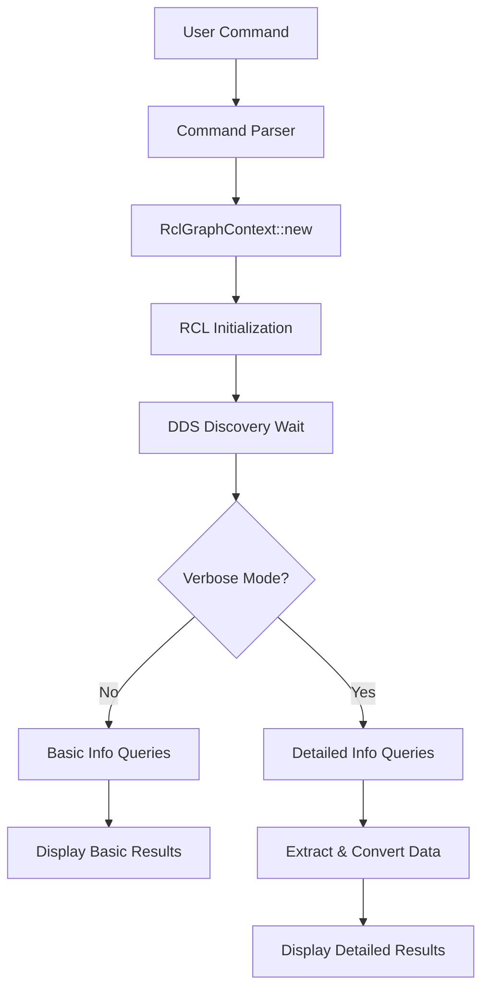

# Topic Information System

The topic information system in `roc` provides comprehensive details about ROS 2 topics, including basic metadata and detailed endpoint information with QoS profiles. This chapter explains how the system works and what information it provides.

## Command Structure

The topic info command follows this pattern:
```bash
roc topic info <topic_name> [--verbose]
```

- **Basic mode**: Shows topic type, publisher count, and subscriber count
- **Verbose mode**: Adds detailed endpoint information including QoS profiles, GIDs, and type hashes

## Information Hierarchy

### Basic Information
```
Type: std_msgs/msg/String
Publisher count: 1  
Subscription count: 1
```

This basic information comes from:
1. `rcl_get_topic_names_and_types()` - for the topic type
2. `rcl_count_publishers()` - for publisher count
3. `rcl_count_subscribers()` - for subscriber count

### Detailed Information (Verbose Mode)
```
Publishers:
  Node name: talker
  Node namespace: /
  Topic type: std_msgs/msg/String
  Topic type hash: RIHS01_df668c740482bbd48fb39d76a70dfd4bd59db1288021743503259e948f6b1a18
  Endpoint type: PUBLISHER
  GID: 01.0f.ba.ec.43.55.39.96.00.00.00.00.00.00.14.03
  QoS profile:
    Reliability: RELIABLE
    History (KEEP_LAST): 10
    Durability: VOLATILE
    Lifespan: Infinite
    Deadline: Infinite
    Liveliness: AUTOMATIC
    Liveliness lease duration: Infinite
```

## Data Flow Architecture



## Implementation Details

### Basic Information Collection

The basic mode uses simple counting operations:

```rust
fn run_command(matches: ArgMatches, common_args: CommonTopicArgs) -> Result<()> {
    let topic_name = matches.get_one::<String>("topic_name")?;
    let verbose = matches.get_flag("verbose");
    
    let create_context = || -> Result<RclGraphContext> {
        RclGraphContext::new()
            .map_err(|e| anyhow!("Failed to initialize RCL context: {}", e))
    };
    
    // Get topic type
    let topic_type = {
        let context = create_context()?;
        let topics_and_types = context.get_topic_names_and_types()?;
        topics_and_types.iter()
            .find(|(name, _)| name == topic_name)
            .map(|(_, type_name)| type_name.clone())
            .ok_or_else(|| anyhow!("Topic '{}' not found", topic_name))?
    };
    
    // Get counts
    let publisher_count = create_context()?.count_publishers(topic_name)?;
    let subscriber_count = create_context()?.count_subscribers(topic_name)?;
    
    println!("Type: {}", topic_type);
    println!("Publisher count: {}", publisher_count);
    println!("Subscription count: {}", subscriber_count);
    
    // ... verbose mode handling
}
```

### Detailed Information Collection

For verbose mode, we query detailed endpoint information:

```rust
if verbose {
    let publishers_info = create_context()?.get_publishers_info(topic_name)?;
    let subscribers_info = create_context()?.get_subscribers_info(topic_name)?;
    
    println!("\nPublishers:");
    for pub_info in publishers_info {
        display_endpoint_info(&pub_info);
    }
    
    println!("\nSubscribers:");
    for sub_info in subscribers_info {
        display_endpoint_info(&sub_info);
    }
}
```

## Data Structures

### TopicEndpointInfo Structure
```rust
#[derive(Debug, Clone)]
pub struct TopicEndpointInfo {
    pub node_name: String,              // Node that owns this endpoint
    pub node_namespace: String,         // Node's namespace  
    pub topic_type: String,             // Message type name
    pub topic_type_hash: String,        // Hash of message definition
    pub endpoint_type: EndpointType,    // PUBLISHER or SUBSCRIPTION
    pub gid: Vec<u8>,                   // Global unique identifier
    pub qos_profile: QosProfile,        // Quality of Service settings
}
```

### QosProfile Structure
```rust
#[derive(Debug, Clone)]
pub struct QosProfile {
    pub history: QosHistoryPolicy,           // KEEP_LAST, KEEP_ALL
    pub depth: usize,                        // Queue depth for KEEP_LAST
    pub reliability: QosReliabilityPolicy,   // RELIABLE, BEST_EFFORT
    pub durability: QosDurabilityPolicy,     // VOLATILE, TRANSIENT_LOCAL
    pub deadline_sec: u64,                   // Deadline seconds
    pub deadline_nsec: u64,                  // Deadline nanoseconds
    pub lifespan_sec: u64,                   // Lifespan seconds
    pub lifespan_nsec: u64,                  // Lifespan nanoseconds
    pub liveliness: QosLivelinessPolicy,     // Liveliness policy
    pub liveliness_lease_duration_sec: u64,  // Lease duration seconds
    pub liveliness_lease_duration_nsec: u64, // Lease duration nanoseconds
    pub avoid_ros_namespace_conventions: bool, // Bypass ROS naming
}
```

## Information Sources and Mapping

### RCL/RMW Source Mapping
| Display Field | RCL/RMW Source | Notes |
|---------------|----------------|-------|
| Type | `rcl_get_topic_names_and_types()` | Basic topic type |
| Publisher count | `rcl_count_publishers()` | Simple count |
| Subscription count | `rcl_count_subscribers()` | Simple count |
| Node name | `rmw_topic_endpoint_info_t.node_name` | From detailed query |
| Node namespace | `rmw_topic_endpoint_info_t.node_namespace` | From detailed query |
| Topic type hash | `rmw_topic_endpoint_info_t.topic_type_hash` | Message definition hash |
| Endpoint type | `rmw_topic_endpoint_info_t.endpoint_type` | PUBLISHER/SUBSCRIPTION |
| GID | `rmw_topic_endpoint_info_t.endpoint_gid` | DDS global identifier |
| QoS profile | `rmw_topic_endpoint_info_t.qos_profile` | Complete QoS settings |

### Topic Type Hash Format
The topic type hash uses the RIHS (ROS Interface Hash Standard) format:
```
RIHS01_<hex_hash>
```
Where:
- `RIHS01` indicates version 1 of the ROS Interface Hash Standard
- `<hex_hash>` is the SHA-256 hash of the message definition

### GID Format
Global Identifiers (GIDs) are displayed as dot-separated hexadecimal:
```
01.0f.ba.ec.43.55.39.96.00.00.00.00.00.00.14.03
```
This 16-byte identifier uniquely identifies the DDS endpoint.

## QoS Policy Interpretation

### Reliability
- **RELIABLE**: Guarantees delivery, may retry
- **BEST_EFFORT**: Attempts delivery, may lose messages
- **SYSTEM_DEFAULT**: Uses DDS implementation default

### History
- **KEEP_LAST**: Keep only the last N messages (N = depth)
- **KEEP_ALL**: Keep all messages subject to resource limits
- **SYSTEM_DEFAULT**: Uses DDS implementation default

### Durability
- **VOLATILE**: Messages not persisted
- **TRANSIENT_LOCAL**: Messages persisted for late-joining subscribers
- **SYSTEM_DEFAULT**: Uses DDS implementation default

### Liveliness  
- **AUTOMATIC**: DDS automatically asserts liveliness
- **MANUAL_BY_TOPIC**: Application must assert liveliness per topic
- **SYSTEM_DEFAULT**: Uses DDS implementation default

### Duration Values
Duration values are displayed in nanoseconds:
- **Infinite**: `9223372036854775807` nanoseconds (effectively infinite)
- **Zero**: `0` nanoseconds (immediate)
- **Finite**: Actual nanosecond values

## Error Handling

### Topic Not Found
When a topic doesn't exist:
```
Error: Topic '/nonexistent' not found. [No daemon running]
```

The error message includes daemon status for compatibility with `ros2` CLI.

### Context Initialization Failures
If RCL initialization fails:
```
Error: Failed to initialize RCL context: <error_code>
```

### Discovery Timeouts
If no endpoints are found but the topic exists, this typically indicates:
1. Publishers/subscribers haven't started discovery yet
2. Network connectivity issues
3. Domain ID mismatches

## Performance Considerations

### Context Reuse Strategy
The current implementation creates a new context for each query operation. This trade-off:
- **Pros**: Ensures fresh discovery information, prevents stale state
- **Cons**: ~150ms overhead per context creation

Future optimizations could cache contexts with invalidation strategies.

### Memory Usage
- Basic queries: ~1MB (RCL/DDS overhead)
- Detailed queries: +~10KB per endpoint (QoS and string data)
- Peak usage during array processing before conversion to Rust types

### Discovery Timing
The 150ms discovery timeout balances:
- **Completeness**: Enough time for DDS discovery protocol
- **Responsiveness**: Fast enough for interactive use
- **Reliability**: Consistent results across different DDS implementations

This information system provides the foundation for understanding ROS 2 system behavior and debugging communication issues.
